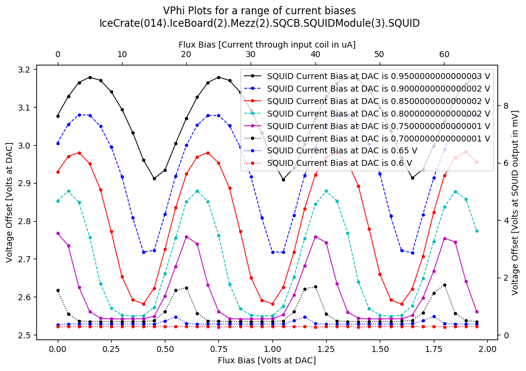
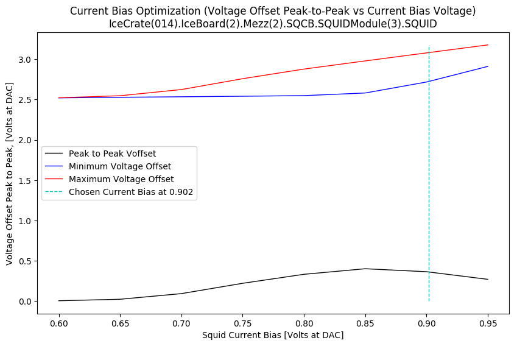
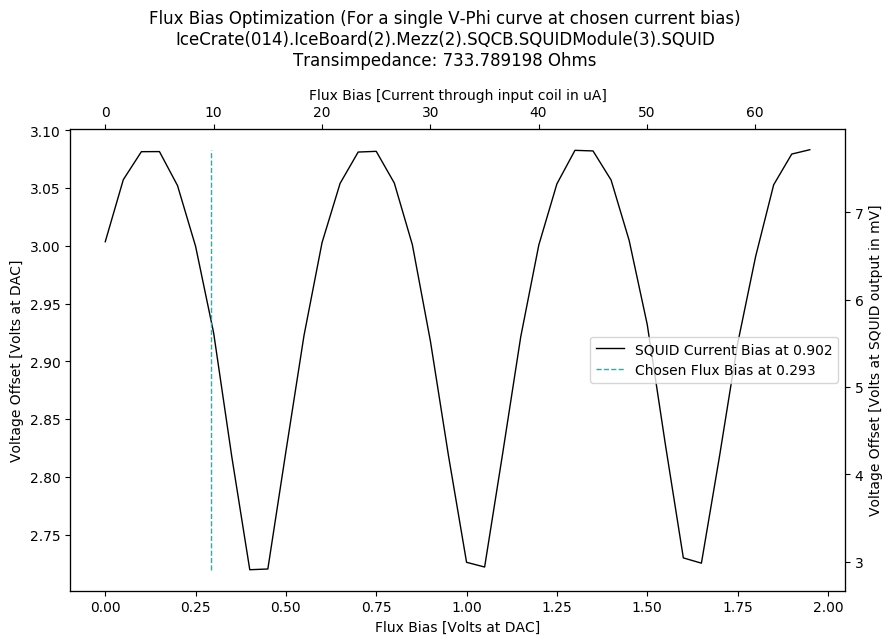

SQUID Tuning Algorithm Output
=============================

Target Data
-----------

+-------------------------------------------------------------------------------------------------------------------------+-------------------------------------------------------------------------------------------------------------------------+
| Full target name                                                                                                        | IceCrate(014).IceBoard(2).Mezz(2).SQCB.SQUIDModule(3).SQUID                                                             |
+-------------------------------------------------------------------------------------------------------------------------+-------------------------------------------------------------------------------------------------------------------------+
| HWM Name                                                                                                                | PB2 HWM                                                                                                                 |
+-------------------------------------------------------------------------------------------------------------------------+-------------------------------------------------------------------------------------------------------------------------+
| HWM Path                                                                                                                | /home/polarbear/hardware_maps/polarbear/PB2b/commissioning/202305_crate_test/crate_hwm_202310_shift_disable_bad_sq.yaml |
+-------------------------------------------------------------------------------------------------------------------------+-------------------------------------------------------------------------------------------------------------------------+

Plots
-----

|

|

|

Additional Data
---------------

+-------------------------------------+-------------------------------------+
| Measured Transimpedance             | 733.79 Ohms                         |
+-------------------------------------+-------------------------------------+
| Chosen Flux Bias                    | 0.29 Volts                          |
+-------------------------------------+-------------------------------------+
| Chosen Current Bias                 | 0.90 Volts                          |
+-------------------------------------+-------------------------------------+
| Peak to Peak at Chosen Current Bias | 0.36 Volts                          |
+-------------------------------------+-------------------------------------+
| Reference Current Bias Used         | Unavailable                         |
+-------------------------------------+-------------------------------------+

 NOTE: 
	The Flux Bias and Current Bias are given as Voltages at the output of the Flux Bias and Current Bias DACs