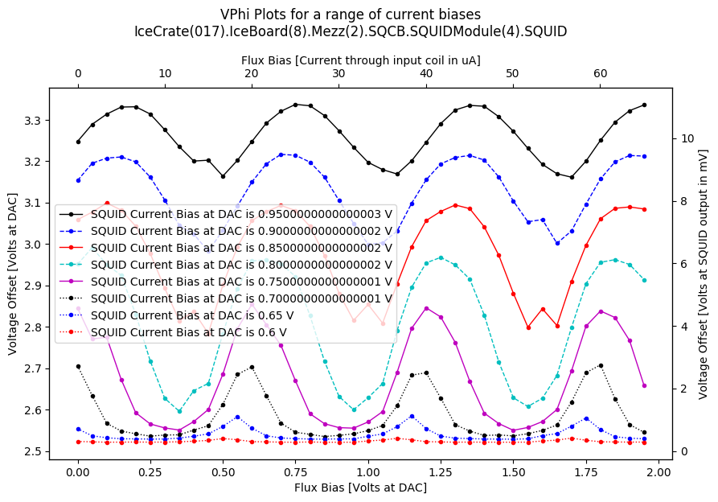
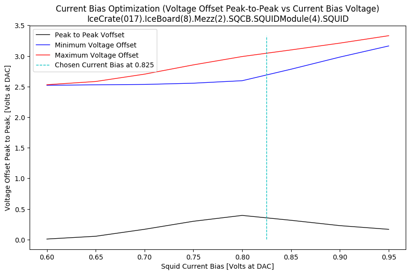
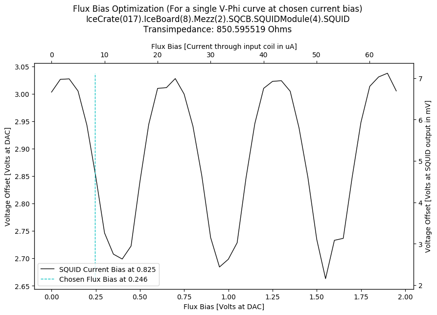

SQUID Tuning Algorithm Output
=============================

Target Data
-----------

+----------------------------------------------------------------------------------------------------------------------------+----------------------------------------------------------------------------------------------------------------------------+
| Full target name                                                                                                           | IceCrate(017).IceBoard(8).Mezz(2).SQCB.SQUIDModule(4).SQUID                                                                |
+----------------------------------------------------------------------------------------------------------------------------+----------------------------------------------------------------------------------------------------------------------------+
| HWM Name                                                                                                                   | PB2 HWM                                                                                                                    |
+----------------------------------------------------------------------------------------------------------------------------+----------------------------------------------------------------------------------------------------------------------------+
| HWM Path                                                                                                                   | /home/polarbear/hardware_maps/polarbear/PB2b/commissioning/202305_crate_test/crate_hwm_202310_shift_disable_bad_sq_v2.yaml |
+----------------------------------------------------------------------------------------------------------------------------+----------------------------------------------------------------------------------------------------------------------------+

Plots
-----

|

|

|

Additional Data
---------------

+-------------------------------------+-------------------------------------+
| Measured Transimpedance             | 850.60 Ohms                         |
+-------------------------------------+-------------------------------------+
| Chosen Flux Bias                    | 0.25 Volts                          |
+-------------------------------------+-------------------------------------+
| Chosen Current Bias                 | 0.82 Volts                          |
+-------------------------------------+-------------------------------------+
| Peak to Peak at Chosen Current Bias | 0.36 Volts                          |
+-------------------------------------+-------------------------------------+
| Reference Current Bias Used         | Unavailable                         |
+-------------------------------------+-------------------------------------+

 NOTE: 
	The Flux Bias and Current Bias are given as Voltages at the output of the Flux Bias and Current Bias DACs